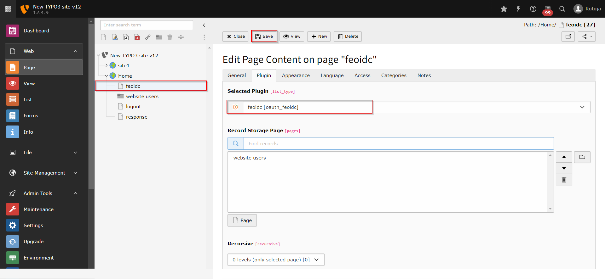
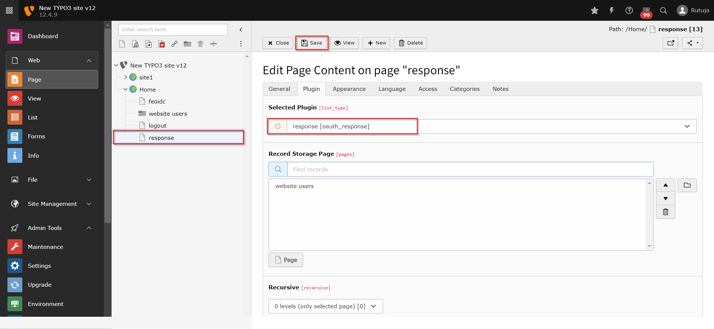
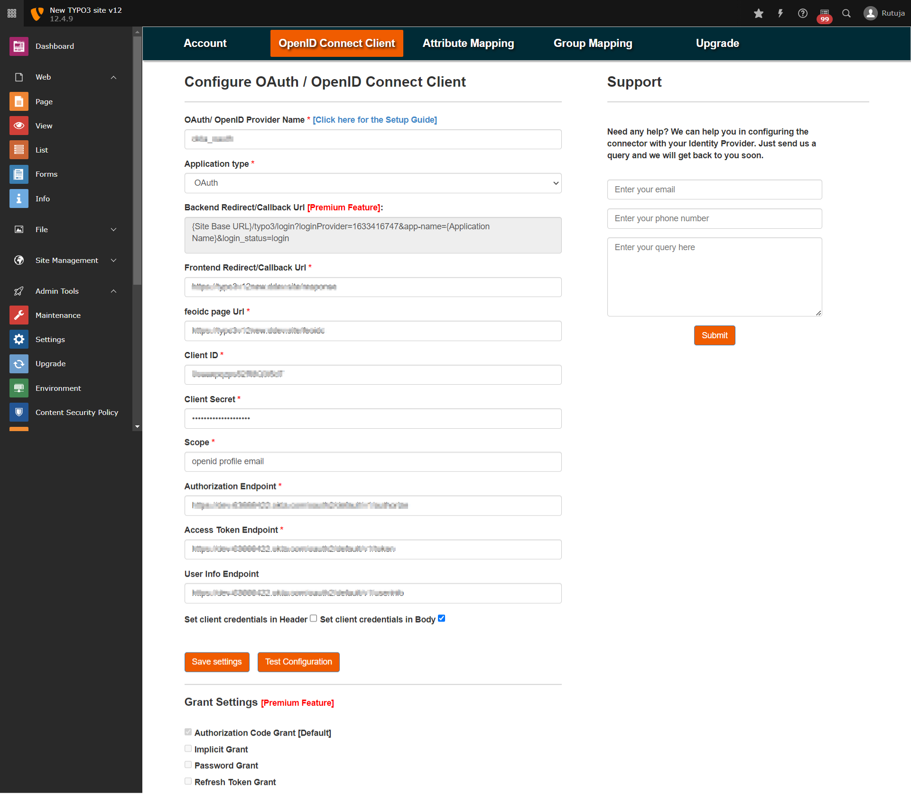
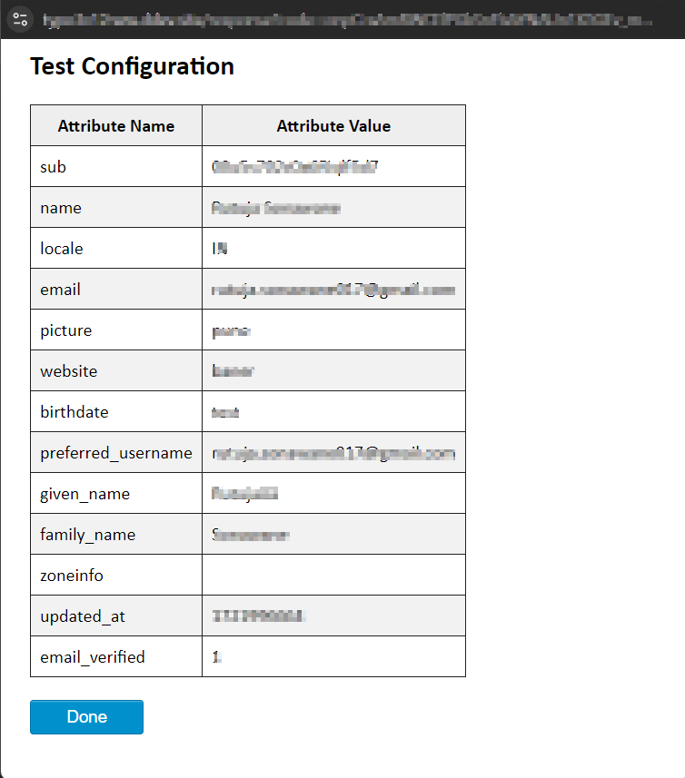
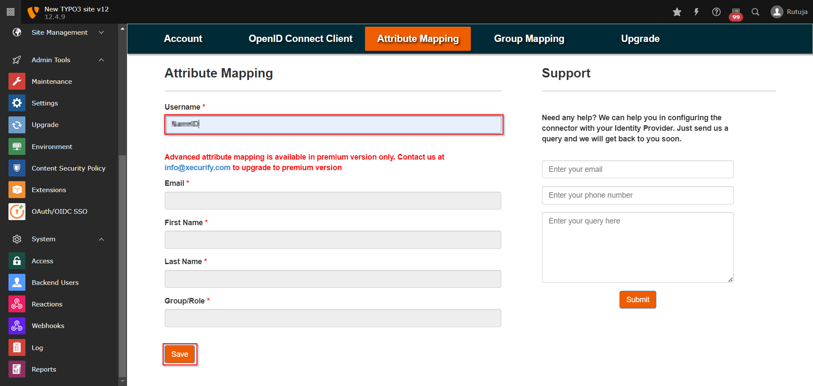
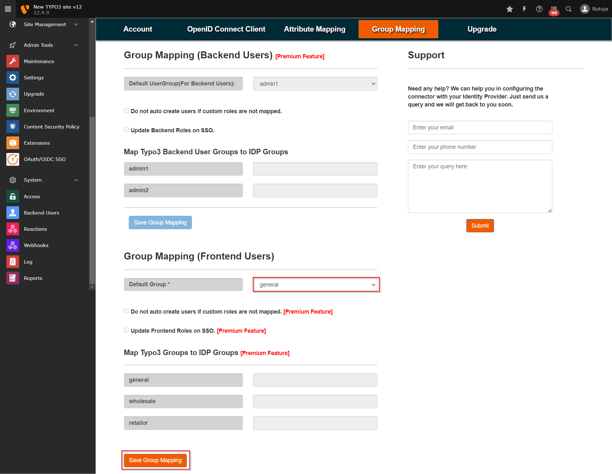

Configuration
=============

Prerequirements Before Configuring
**********************************

You must have atleast two pages before configuring the extension.

.. tip:: Pages can be created by the following steps:-

* Navigate to the Pages section and create new standard page with name feoidc and add feoidc plugin to it.
* Similarly create a page named response and and response plugin to it.
* You can refer to the below screenshots for the same.

* Create SSO Login button in your Typo3 Frontend Site and embed the feoidc page URL to it in order to initiate the SSO.

Extension Configurations
************************

* Once the extension is installed successfully, navigate to the OpenID Connect Client tab of the plugin and fill in all the required fields as below:
	- OAuth/ OpenID Provider Name: {Name of your provider}
	- Application type: OAuth/OpenID Connect
	- Frontend Redirect/Callback Url : {Response Plugin Page URL which you created in step 4} (You will need to provide this URL to your
	  OAuth/OIDC provider)
	- feoidc page URL: {feoidc Plugin Page URL which you created in step 4}
	- Client ID : {You will get it from your provider}
	- Client Secret : {You will get it from your provider}
	- Scope : openid profile email
	- Authorization Endpoint : {Authorization Endpoint of your OAuth/OpenID Provider}
	- Token Endpoint : {Access Token Endpoint of your OAuth/OpenID Provider}
	- User Info Endpoint : {Userinfo Endpoint of your OAuth/OpenID Provider}
	- Set client credentials in : Header/Body

* Provide the redirect/callback URL in your OAuth/OIDC Provider application by copying it from Frontend Redirect/Callback Url field in OpenID Connect Client tab.

* Once you are done with the configurations on both ends (i.e., Typo3 and your OAuth/OIDC Provider), click on the Test Configuration button in the OpenID Connect Client tab of the plugin and check if you are able to test it successfully.

* Navigate to the Attribute Mapping tab and map the Username attribute to your OAuth/OIDC Provider attribute using which you want to identify the users in Typo3 (you can find all the attributes received from your OAuth/OIDC Provider in the test configuration).

* Navigate to the Group Mapping tab of the plugin and save the Group Mapping for Frontend Users by selecting the Default Usergroup.

* Once you have done all the above steps, you are ready to test the SSO. You can use your Feoidc Page URL in order to initiate the SSO.

You can choose the setup guide according to your OAuth/OIDC Provider from below link:
https://plugins.miniorange.com/typo3-sso-single-sign-on-with-oauth-openid-connect-setup-guides